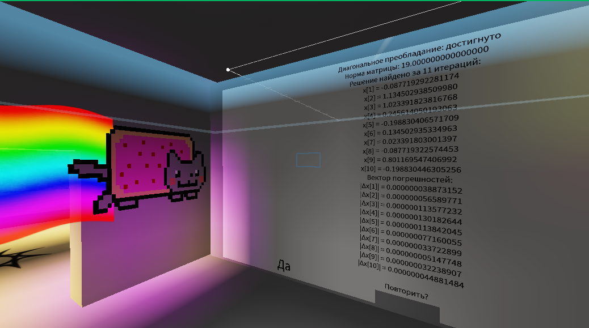
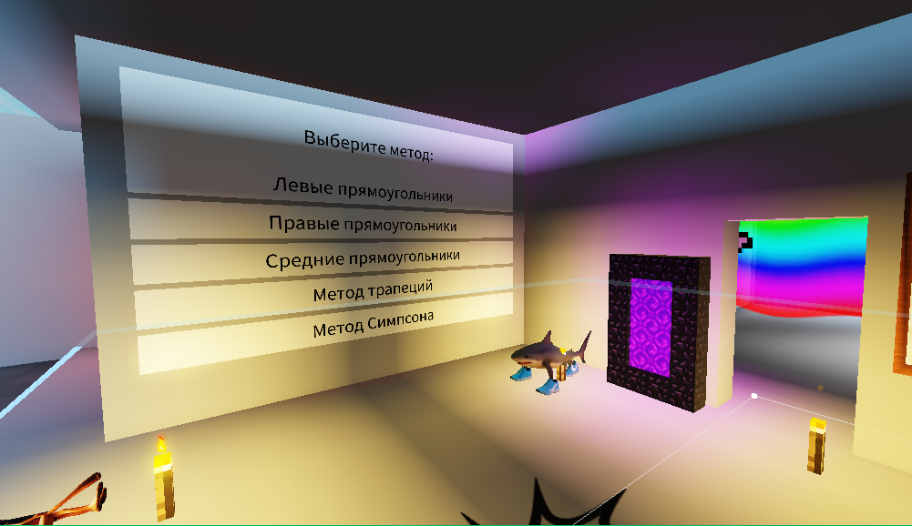
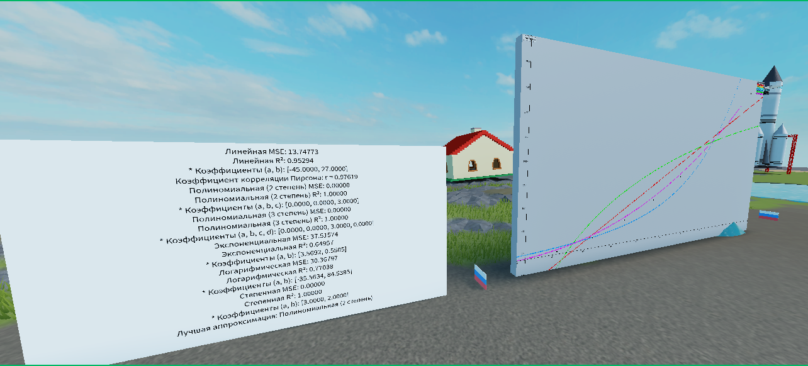
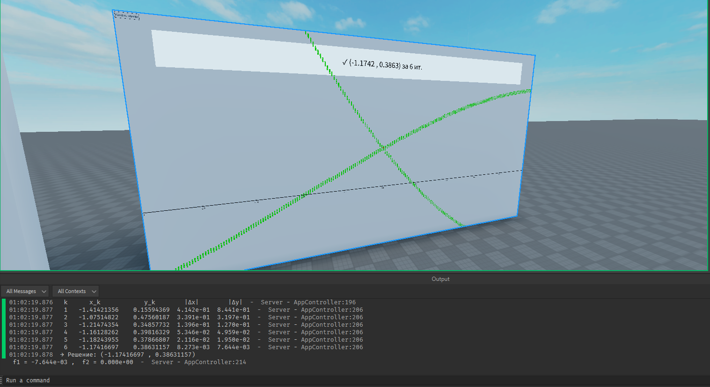
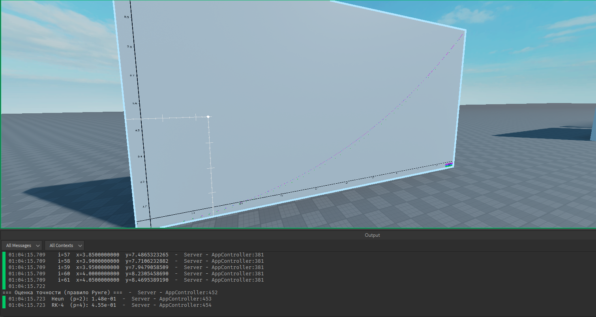
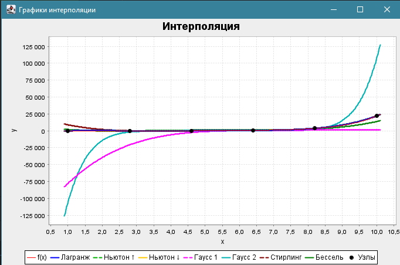

# Computational Mathematics – Interactive Solvers

**Computational_Mathematics** — это коллекция интерактивных визуальных решателей математических задач, выполненных в двух форматах:

- **Roblox Studio** — реализация трёх задач в игровом интерфейсе с визуализацией;
- ☕ **Java** — консольные приложения для численных методов;

---

## 🎮 Задачи, реализованные в Roblox Studio

Открыть проект локально: `asset/game.rbxl`  
Онлайн-версия: [Перейти в Roblox](https://www.roblox.com/games/90143978342885/Game-ITMO)

---

### 🔹 Решение системы линейных уравнений (СЛАУ)

> Решатель для численного решения СЛАУ с размерностью до 20.

**Особенности:**
- Ввод данных с клавиатуры или файла;
- Отображение треугольной матрицы, вектора решений и невязок;
- Проверка точности;
- Интерактивный вывод.

📄 Скрипт: [`linear_system_solver.lua`](roblox_vers/linear_system_solver.lua)  
📷 Демонстрация: 

---

### 🔹 Численное интегрирование

> Решение определённых интегралов с использованием классических численных методов.

**Методы:**
- Прямоугольники (левые, правые, средние);
- Метод трапеций;
- Метод Симпсона.

**Дополнительно:**
- Визуализация графика подынтегральной функции;
- Вывод количества разбиений и точности по правилу Рунге.

📄 Скрипт: [`integration_methods.lua`](roblox_vers/integration_methods.lua)  
📷 Демонстрация: 

---

### 🔹 Аппроксимация функции

> Построение эмпирических моделей по табличным данным методом наименьших квадратов.

**Модели:**
- Линейная, квадратичная, кубическая;
- Логарифмическая, степенная, экспоненциальная.

**Функции:**
- Выбор наилучшей аппроксимации;
- Расчёт MSE, R², коэффициента корреляции;
- Отрисовка графиков и отображение статистики в интерфейсе.

📄 Скрипты:
- [`function_approximation.lua`](roblox_vers/function_approximation.lua)  
- [`function_approximation_2.lua`](roblox_vers/function_approximation_2.lua)  
📷 Демонстрация: 

---

### 🔹 Решение нелинейных уравнений

> Решатель одиночных нелинейных уравнений численными методами.

**Методы:**
- Метод половинного деления;
- Метод хорд;
- Метод Ньютона;
- Метод секущих;
- Метод простой итерации.

**Особенности:**
- Автоматический выбор начального приближения;
- Проверка условий применимости;
- Обработка ошибок ввода.

📄 Скрипт: [`nonlinear_equation.lua`](roblox_vers/nonlinear_equation.lua)  

---

### 🔹 Решение систем нелинейных уравнений

> Итерационные методы для численного решения систем из двух уравнений.

**Методы:**
- Метод Ньютона;
- Метод простой итерации.

**Особенности:**
- Графическое отделение корней;
- Проверка сходимости;
- Подробный пошаговый вывод решений.

📄 Скрипт: [`nonlinear_system.lua`](roblox_vers/nonlinear_system.lua)  
📷 Демонстрация: 

---

### 🔹 Численное решение ОДУ

> Решение задачи Коши для обыкновенных дифференциальных уравнений.

**Методы:**
- Метод Эйлера;
- Метод Рунге-Кутта 4-го порядка;
- Метод Адамса;
- Метод Милна.

**Особенности:**
- Выбор ОДУ из встроенного списка;
- Ввод исходных данных с клавиатуры;
- Построение графиков точного и приближённого решений.

📄 Скрипт: [`ode_solver.lua`](roblox_vers/ode_solver.lua)  
📷 Демонстрация: 

---

## ☕ Реализация на Java

### 🔹 Интерполяция функции

> Алгоритмы интерполяции: вычисление значений функции в точках между узлами.

**Методы:**
- Многочлены Лагранжа;
- Многочлены Ньютона;
- Многочлены Гаусса;
- Многочлен Стирлинга;
- Многочлен Бесселя.

**Особенности:**
- Ввод данных с клавиатуры или файла;
- Генерация таблицы конечных разностей;
- Построение графиков и визуальное сравнение методов.

📁 Папка: `java_vers/`

📷 Демонстрация:

 

 ##  Автор

**Umchik1222**  
ПИИКТ, ИТМО  
2025
